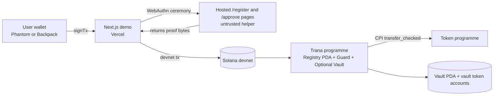

# Trana V1 POC: Passkey-based Execution-time 2FA on Solana (Devnet)

## Executive summary

Trana V1 is a Solana-native guard layer that blocks protected instructions unless the same transaction also proves a valid second-factor signature. The enforcement is on-chain and bypass-resistant because the guarded programme inspects top-level transaction instructions via the Instructions sysvar, so raw transaction crafting cannot skip the proof step.

Passkeys are mandatory in V1. Trana supports real WebAuthn passkeys by storing each user's second-factor public key on chain in a registry PDA derived by `["2fa", user_pubkey]`, then verifying signatures using Solana's native `secp256r1` signature verification precompile (`Secp256r1SigVerify1111111111111111111111111`). This removes the need for a trusted bridge signer and makes the on-chain code and PDA state the primary trust boundary.

To let integrators adopt without changing user wallets (Phantom, Backpack), the recommended demo uses a guarded vault pattern: users deposit assets into PDA-controlled vault token accounts, and withdrawals require both the user's wallet signature (first factor) and a passkey proof (second factor). PDA authority and CPI token transfers are standard Solana and Anchor patterns.

Delivery assumptions are devnet-only, npm workspaces monorepo, and a Vercel-hosted Next.js demo. Route Handlers under `app/api/**/route.ts` provide the WebAuthn ceremony pages and endpoints, but are not trusted and hold no signing keys.

## Problem statement and threat model

On Solana, programmes cannot retrofit additional signature policy into a normal wallet account. Security guarantees must be enforced inside the programme that controls assets or privileged state. Solana explicitly supports "proof-then-execute" patterns using instruction introspection via the Instructions sysvar, which exposes only top-level instructions from the transaction message.

The problem Trana targets is that signing is often not sufficient authorisation for high-risk actions. UI prompts and client simulation are bypassable by building raw transactions. Durable nonces increase the risk of delayed execution because they enable offline signing and later submission, which is exactly the threat model that "execution-time authorisation" addresses.

Threat model for the POC:

- **Wallet key compromise**: attacker can sign transactions as the wallet. Trana aims to protect actions behind guarded execution paths (vault withdrawals, admin actions), not arbitrary wallet activity across the chain.
- **Frontend bypass**: attacker submits a crafted transaction directly to RPC. Trana remains effective because enforcement is on chain via instruction introspection and precompiles.
- **Replay**: attacker reuses previously captured proof data. Trana must bind proofs to a per-user nonce and expiry.
- **Service compromise**: the hosted WebAuthn helper is compromised. Under the recommended architecture it cannot forge signatures because it holds no signing keys.
- **Token/NFT signal pitfalls**: static ownership is not per-action consent and can be transferred, so token gating is not a substitute for cryptographic approval of a specific action.

Operational constraints that shape the design:

- **Atomicity**: transactions are atomic and fees are still charged on failure, which is useful for strong enforcement semantics.
- **Size limit**: 1,232 bytes maximum per transaction packet, including signatures and message, which pushes the design towards hashing and compact proof formats.
- **Compute limits**: default 200,000 CUs per non-builtin instruction, 1,400,000 CUs max per transaction; explicit compute budget instructions can override defaults.

## Trust model and enforcement options

### Trust models

Trana has two trust models worth documenting, but only one should be the recommended POC choice.

**Trusted attestor (bridge signer) model:**
- Flow: passkey approval is verified off chain, then a backend signs a canonical payload hash with an attestor key; the chain verifies that signature via a precompile and instruction introspection.
- Risk: the attestor key becomes a critical trust point; compromise can mint approvals.
- Mitigations: multi-attestor threshold, HSM/KMS, strict expiry, audited signing policies.

**On-chain registry (no trusted signer) model:**
- Flow: the user registers a second-factor public key on chain in a PDA `["2fa", user_pubkey]`. Execution requires a valid signature from that registered key, verified by a precompile instruction present in the transaction.
- Security property: backend compromise cannot forge approvals because the credential private key stays in the authenticator/device.

### Why passkeys require a WebAuthn-aware proof

A WebAuthn authentication assertion signature is computed over a structured signature base: `authenticatorData || hash(clientDataJSON)`. `clientDataJSON` includes the challenge, origin, and type, and `authenticatorData` includes RP ID hash, flags, and counters. This means passkeys are not "raw signers" of arbitrary bytes without additional handling.

For Trana to be truly backend-untrusted while still supporting passkeys, the guarded programme must at minimum be able to validate challenge binding on chain, not just signature validity. The recommended POC achieves this by verifying an ECDSA signature via `secp256r1` precompile and additionally checking that the `clientDataJSON.challenge` equals the canonical Trana payload hash (base64url), plus checking RP ID hash and flags from `authenticatorData`.

### Enforcement options comparison

| Option | What is enforced on chain | Pros | Cons | POC choice |
|---|---|---|---|---|
| Off-chain proof + on-chain attestor signature | Attestor signature over payload hash | Fast to implement | Attestor key is trusted; compromise can forge approvals | Not recommended |
| On-chain 2FA registry + on-chain verification | User's registered key in PDA must match precompile verify instruction | Backend compromise cannot forge; auditability on chain | Must handle WebAuthn proof structure | **Recommended** |
| Minimal flags (opt_in, has_passkey) | Policy gating only | Better UX | Flags are not authorisation | Optional complement |
| Token/NFT signals | Ownership gates a flow | Composable badge | Static ownership is not consent | Avoid for MVP |
| Guarded vault / smart-wallet pattern | PDA custody + guard enforcement on withdrawals | Strongest demo | Requires deposits; custody UX | **Recommended as demo vehicle** |

### Policy engine design

Trana ships a deterministic policy engine:

```text
PolicyNode = Any([PolicyNode]) | All([PolicyNode]) | Rule(PolicyRule)

PolicyRule = Always
           | HighValue { threshold_lamports: u64 }
           | UserOptIn
           | AdminAction
```

Use `policy_id: u8` presets rather than full trees in instruction data to stay within the 1,232-byte transaction size cap.

| policy_id | Expansion |
|---|---|
| 1 | `Any([HighValue(threshold), UserOptIn])` |
| 2 | `Any([Always])` |

## Final POC architecture

### Component overview

```text
Wallet (Phantom/Backpack) signs transaction
   |
   |  Tx = [SignatureVerifyPrecompileIx, GuardedInstructionIx]
   v
Solana devnet
   |
   |  Guard loads ["2fa", user_pubkey] registry PDA
   |  Guard introspects verify instruction via Instructions sysvar
   |  Guard checks policy, nonce, expiry and WebAuthn bindings
   v
Executes or fails atomically
```



### On-chain accounts and PDAs

| Account | Seed | Purpose | Key fields |
|---|---|---|---|
| Config PDA | `["config"]` | System parameters | `policy_id`, `threshold`, `rp_id_hashes`, `enabled` |
| 2FA Registry PDA | `["2fa", user_pubkey]` | User's passkey verifier + anti-replay | `owner`, `key_kind`, `pubkey` (33 bytes), `enabled`, `nonce` |
| Vault PDA | `["vault", user_pubkey]` | PDA authority for custody (demo) | `owner`, `bump` |
| Vault token account | owned by Token programme | SPL token custody | standard token account |

### Registration and approval flows

**Registration URL:**
```
https://trana.network/register
  ?wallet=<base58>
  &return_url=<encoded>
  &state=<csrf_token>
```

**Registration callback:**
```
https://app.example/trana/callback
  ?status=success
  &wallet=<base58>
  &tx=<sig>
  &state=<csrf_token>
```

**Approval URL:**
```
https://trana.network/approve
  ?wallet=<base58>
  &payload=<base64url_payload_hash>
  &return_url=<encoded>
  &state=<csrf_token>
```

**Approval callback:**
```
https://app.example/trana/approved
  ?status=approved
  &sig=<base64url_compact_sig>
  &hash=<base64url_payload_hash>
  &state=<csrf_token>
```

### How passkey proof is verified on chain

Key points from Solana's secp256r1 precompile:
- Verifies up to 8 signatures per instruction.
- Signatures are 64-byte compact `(r||s)`, pubkeys are 33-byte compressed, message is arbitrary bytes.
- Low-S signatures are required.

Minimal on-chain WebAuthn checks implemented in Trana V1:

1. Verify the P-256 signature via secp256r1 precompile (done by the precompile itself).
2. Verify the `message` in the precompile instruction equals `authenticatorData || SHA256(clientDataJSON)`.
3. Verify flags in `authenticatorData[32]` include user presence (bit 0).
4. Verify `clientDataJSON.challenge` (base64url) equals the canonical Trana payload hash.
5. Verify nonce and expiry from the Trana registry PDA state.

Optional (V2): verify `rpIdHash` in `authenticatorData[0..32]` against a whitelist in Config PDA.

### WebAuthn data flow

```text
Client                              On-chain program
──────────────────────────────────────────────────────
payloadHash = sha256(canonicalJson)
challenge = base64url(payloadHash)

WebAuthn.get(challenge)
  → authenticatorData
  → clientDataJSON  {"challenge": "<base64url(payloadHash)>", ...}
  → signature (DER) → convert to compact (r||s)

Build precompile ix:
  message = authenticatorData || SHA256(clientDataJSON)
  sig     = compact P-256 sig
  pubkey  = 33-byte compressed

Build enforce CPI ix:
  payload_hash    = payloadHash
  expiry          = unix ts
  webauthn = Some({authenticatorData, clientDataJSON})

tx = [secp256r1Ix, protectedIx]
                                    Receive tx
                                    secp256r1 precompile verifies sig
                                    enforce() reads secp256r1 ix from sysvar
                                    Checks: pubkey matches registry
                                    Checks: message == authData||SHA256(cdj)
                                    Checks: challenge in cdj == payloadHash
                                    Checks: UP flag set
                                    Checks: nonce, expiry
                                    → Ok or fail atomically
```

## Developer integration

### CPI integration (recommended)

```toml
guard = { git = "https://github.com/beharefe/trana-guard", features = ["cpi"] }
```

```rust
pub fn withdraw(ctx: Context<Withdraw>, amount: u64, expiry: i64,
                webauthn: Option<guard::WebAuthnData>) -> Result<()>
{
    let payload_hash = sha256(canonical_json(program_id, vault, amount, nonce, expiry));

    guard::cpi::enforce(
        CpiContext::new(trana_program, guard::cpi::accounts::Enforce {
            registry:     trana_registry,
            instructions: instructions_sysvar,
        }),
        guard::Policy::VaultWithdraw,
        payload_hash,
        expiry,
        webauthn,
    )?;

    // CPI transfer_checked out of vault PDA
    Ok(())
}
```

### TypeScript SDK

```typescript
// 1. Compute payload hash
const payloadHash = trana.computePayloadHash("trana.solana", wallet, programId, "VaultWithdraw", nonce, expiry)

// 2. Get approval (redirect-based)
const url = trana.buildApprovalRedirectUrl(
  { domain: "trana.solana", userPubkey: wallet, programId, policy: "VaultWithdraw", nonce, expiry },
  "https://trana.network",
  `${origin}/approved`,
  csrfState
)
// ... user redirected back ...
const proof = trana.parseApproveRedirectResult(searchParams)

// 3. Build transaction
const message  = buildWebAuthnMessage(proof.authenticatorData, proof.clientDataJSON)
const proofIx  = buildSecp256r1Ix(registeredPubkey, proof.signature, message)
const guardedIx = await program.methods.withdraw(amount, expiry, {
  authenticatorData: Array.from(proof.authenticatorData),
  clientDataJson:    Array.from(proof.clientDataJSON),
}).instruction()

const tx = new Transaction().add(proofIx).add(guardedIx)
```

## Security, privacy, and cost considerations

### Attacker scenarios

| Scenario | Without Trana | With Trana V1 |
|---|---|---|
| Wallet key compromise | Attacker withdraws freely | Cannot withdraw without passkey proof |
| Backend compromise | N/A | Backend cannot forge secp256r1 proofs — no credential key |
| Replay attack | Depends on app | Nonce + expiry enforced onchain |
| Raw transaction bypass | Succeeds | Fails — proof required at execution time |
| Token/NFT transfer bypass | Works as "auth" | Not used — cryptographic proof only |

### Proof encoding constraints

Transaction size is capped at 1,232 bytes:
- Precompile instruction: ~16 (header) + 33 (pubkey) + 64 (sig) + ~150 (WebAuthn message) ≈ 263 bytes
- Enforce CPI instruction: discriminator + policy + payload_hash + expiry + authenticatorData + clientDataJSON ≈ 350–500 bytes
- Total proof overhead: ~600–800 bytes, leaving ~400–600 bytes for the protected instruction

For instructions with many accounts, use `compute_budget::set_loaded_accounts_data_size_limit` if needed.

### Privacy

Storing a passkey public key on chain is acceptable (it is a public verifier). Storing credential IDs on chain creates correlation risk — treat them as optional and consider omitting or hashing them in production.

## MVP checklist

### Programme
- [x] `["2fa", user_pubkey]` registry PDA with nonce and compressed secp256r1 pubkey
- [x] `enforce` CPI endpoint — reads secp256r1 precompile via Instructions sysvar
- [x] Nonce and expiry enforced using Clock sysvar
- [x] `Policy` enum emitted in `EnforceEvent` for audit trail
- [x] Full WebAuthn binding checks: message format, UP flag, challenge extraction
- [ ] `rpIdHash` whitelist in Config PDA (V2)
- [ ] CPI `transfer_checked` vault with SPL tokens (currently native SOL)

### SDK
- [x] `buildSecp256r1Ix` — secp256r1 precompile instruction builder
- [x] `computePayloadHash` — canonical hash with domain separator
- [x] `prepareTransaction` — high-level API
- [x] `buildApproveRedirectUrl` / `parseApproveRedirectResult`
- [x] `buildWebAuthnMessage` — `authenticatorData || SHA256(clientDataJSON)` helper
- [ ] `buildRegisterRedirectUrl` with state param
- [ ] `buildApprovalRedirectUrl` with state param

### Web app
- [x] `/register` page: WebAuthn create → `register_two_fa` onchain
- [x] `/approve` page: WebAuthn get → redirect back with P-256 signature
- [x] `/api/approve/verify`: returns raw P-256 sig + authenticatorData + clientDataJSON
- [x] No server signing keys anywhere

### Demo scenarios
- [ ] Withdraw without proof fails
- [ ] Tampered parameters fail (PayloadMismatch)
- [ ] Replay fails (InvalidNonce)
- [ ] Valid passkey proof succeeds

---

## Source references

- Solana instruction introspection: https://solana.com/docs/core/instructions/instruction-introspection
- Solana precompiles: https://solana.com/docs/core/programs/precompiles
- Solana compute budget: https://solana.com/docs/core/fees/compute-budget
- Solana transaction structure: https://solana.com/docs/core/transactions/transaction-structure
- Anchor PDA accounts: https://www.anchor-lang.com/docs/basics/pda
- Anchor CPI: https://www.anchor-lang.com/docs/basics/cpi
- Anchor transfer_checked: https://www.anchor-lang.com/docs/tokens/basics/transfer-tokens
- W3C WebAuthn spec: https://www.w3.org/TR/webauthn-2/
- SimpleWebAuthn: https://simplewebauthn.dev/docs/packages/server/
- Phantom signing: https://docs.phantom.com/phantom-deeplinks/provider-methods/signtransaction
- Backpack signing: https://docs.backpack.app/deeplinks/provider-methods/signtransaction
- Vercel functions: https://vercel.com/docs/functions/functions-api-reference
- Next.js Route Handlers: https://nextjs.org/docs/app/getting-started/route-handlers
- npm workspaces: https://docs.npmjs.com/cli/using-npm/workspaces
