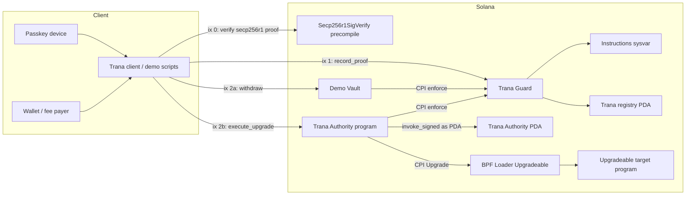

# Trana Hackathon Pitch and Demo Blueprint

## Executive summary

The strongest framing for Trana is not “2FA for Solana”, but **“the authorization layer for Solana”**. In V1, that resolves into two clear primitives. **Trana Guard** answers *“should this instruction execute?”* inside programs you control, while **Trana Authority PDA** answers *“should this authority sign?”* for any authority that can be reassigned to a PDA. That maps directly onto Solana’s model: transactions are explicit instruction lists, the Instructions sysvar can inspect sibling top-level instructions, PDAs can only “sign” through `invoke_signed`, upgradeable programs are controlled through ProgramData upgrade authority, and token mints already expose native mint/freeze authority roles that can be reassigned. citeturn8view0turn8view1turn7view0turn7view1turn8view2

For a hackathon, the highest-leverage entry is an **attack-first, proof-second** story. Recent official Solana hackathon pages require a working prototype, deployed programs, documentation, open-source code, and a demo video capped at three minutes; earlier Solana Foundation judging criteria explicitly emphasised functionality, potential impact, novelty, design, and composability. A 90–120 second technical cut is therefore ideal: it stays well within the three-minute cap while leaving no ambiguity that the product works and why it matters. citeturn19view0turn8view3

Technically, the most important constraint shaping the demo is this: Solana’s secp256r1 verifier is a **precompile** that runs natively and is **not callable by CPI**, while the Instructions sysvar only exposes **top-level** transaction instructions, not CPI inner instructions. That means your proof flow must be assembled client-side as a single transaction with: **`Secp256r1SigVerify` → `record_proof` → guarded instruction**. This constraint is not a weakness; it is the kernel of the demo’s credibility, because it lets judges see that Trana is binding a device-approved proof to the exact transaction structure the chain executes. citeturn17view0turn8view0

This report takes your V1 brief as the authoritative source for Trana-specific behaviour. The Trana repository itself was not directly accessible in this environment, so all Trana-specific recommendations below are derived from the architecture you supplied, while all Solana mechanics are grounded in primary Solana documentation and source references.

## Pitch architecture

The pitch should deliberately follow the Solana hackathon rubric: **functionality first, impact second, novelty third, design and composability throughout**. That means you should not open with cryptography, passkeys, or account abstraction. You should open with a compromised key and a privileged action that still fails. That is the shortest path to functionality, impact, and novelty in one beat. citeturn8view3

### Pitch matrix

| Format | Goal | Recommended script | What the judge should retain |
|---|---|---|---|
| Elevator | One-sentence positioning | **“Trana is the authorization layer for Solana: it can enforce approval inside a program, or become the authority itself, so leaked admin keys cannot drain funds or ship malicious upgrades without device-approved proof.”** | Not “wallet UX”; real infra |
| Thirty seconds | Problem + solution + demo hook | “On Solana, the biggest failures are privileged failures: a leaked withdrawal key drains funds, or a leaked upgrade key ships malicious code. Trana secures both. If you own the program, add `guard::cpi::enforce()` to gate sensitive instructions. If you do not want to modify the target, transfer authority to a Trana PDA that only signs after passkey proof. In our demo, a leaked vault or upgrade key fails first, then succeeds only after approval.” | Two primitives, one mental model |
| Ninety seconds | Full product framing | “Trana has two primitives. Guard protects instruction execution inside integrated programs. Authority PDA protects any transferable privileged authority without changing the target code. We demonstrate both: a vault drain attempt is blocked without proof, and a program upgrade attempt is blocked even though the admin key is leaked, because the real upgrade authority is a PDA. The same upgrade succeeds only after on-device passkey approval. So Trana secures both **what can execute** and **who can authorize**.” | This is infrastructure, not a feature |
| Three-slide outline | Maximum compression | Slide 1: **Privileged keys fail catastrophically**. Slide 2: **Trana = Guard + Authority PDA**. Slide 3: **Demo: leaked key blocked, approved action succeeds**. | One core product image |
| Seven-slide outline | Full hackathon deck | Threat, why existing controls fail, Guard primitive, Authority PDA primitive, Vault demo, Upgrade demo, adoption path. | Clear product + clear roadmap |

The pitch language should use exact, repeatable phrases. The most effective lines are the ones that compress the architecture into a contrast judges can repeat afterwards.

### Core messages, killer lines, and rebuttals

The deck should repeat four messages.

First, **“Trana is the authorization layer for Solana.”** That is the category claim.

Second, **“Guard secures what can execute; Authority PDA secures who can authorize.”** That is the architecture split.

Third, **“The leaked key can request the action; it cannot authorize execution.”** That is the emotional hook.

Fourth, **“No code changes where authority can be transferred; a single CPI where you own the program.”** That is the adoption hook, and it is credible because Solana already supports reassigning upgrade authority on ProgramData and authority roles on token mints and token accounts. citeturn15view0turn7view1turn8view1

The most likely judge questions, and the best answers, are below.

| Likely question | Best answer |
|---|---|
| **Is this just 2FA?** | “No. 2FA is a login concept. Trana is on-chain authorization. It binds device-approved proof to an exact Solana action: a specific instruction, account set, and authority path.” |
| **Why not just use multisig?** | “Multisig spreads trust across signers. Trana enforces second-factor approval and exact-intent authorization. It complements multisig rather than replacing it.” |
| **Why not revoke upgrade authority entirely?** | “Revocation makes a program immutable. Solana’s upgradeable loader docs are explicit that setting upgrade authority to `None` permanently prevents future updates. Trana preserves upgradeability while removing single-factor risk.” citeturn7view0turn18search1 |
| **Does this work on already deployed programs?** | “Yes where the target exposes transferable authority. Program upgrade authority can be reassigned, and SPL Token roles such as mint and freeze authority can be reassigned via `SetAuthority`. The PDA has no private key, so only Trana’s program can sign for it.” citeturn15view0turn7view1turn8view1 |
| **How does the chain know the proof matches this transaction?** | “The secp256r1 verifier runs natively, and Guard can inspect sibling top-level instructions using the Instructions sysvar. So the proof is checked in the same transaction context as the protected action.” citeturn17view0turn8view0 |
| **What about recovery?** | “Not in hackathon V1. We intentionally focused on proving the core authorization primitives correctly before adding lifecycle complexity.” |

A useful way to answer “why now?” is to anchor it in the upgradeable loader itself. Solana’s own upgradeable loader documentation and source material make clear that an upgrade authority can update a program at any time unless it is revoked, and that this breaks immutability. That is exactly why the upgrade demo is the best flagship: the chain already treats upgrade authority as a high-privilege role; Trana simply hardens it. citeturn7view0turn14view0

## Demo architecture

The architecture should be explained once, very simply, then shown twice: once for **fund protection** and once for **infrastructure protection**. The underlying Solana mechanics are already there. PDAs are deterministic, off-curve addresses with no private key, and only their owning program can sign for them through `invoke_signed`. Upgradeable programs store the mutable code and authority in ProgramData; upgrades require the correct authority and consume a prepared buffer account. SPL Token mints similarly expose explicit authority roles such as `mint_authority` and `freeze_authority`, updated through `SetAuthority`. citeturn8view1turn7view0turn15view0turn7view1turn8view2

### Minimal architecture diagram



This diagram matters because it makes a subtle technical point visually obvious: the proof verifier sits **outside** Guard as a top-level precompile instruction, because Solana precompiles are not callable by CPI, while Guard relies on top-level instruction introspection. citeturn17view0turn8view0

### Transaction anatomy

The approved vault-withdraw transaction should look like this:

```text
[0] Secp256r1SigVerify1111111111111111111111111
[1] trana_guard::record_proof
[2] demo_vault::withdraw
```

The approved upgrade transaction should look like this:

```text
[0] Secp256r1SigVerify1111111111111111111111111
[1] trana_guard::record_proof
[2] trana_authority::execute_upgrade
     └─ CPI: BPFLoaderUpgradeab1e11111111111111111111111::Upgrade
```

That ordering is deliberate. The Instructions sysvar can only see top-level instructions, and the secp256r1 verifier itself is a top-level precompile; Guard then inspects the sibling instructions in the same transaction before allowing execution. For the upgrade path, the BPF loader expects ProgramData, Program, Buffer, Spill, Rent, Clock, and the authority signer in the instruction account list. citeturn8view0turn17view0turn15view0

### The two demo flows

| Demo flow | What it proves | Key on-chain effect |
|---|---|---|
| **Vault drain** | Guard blocks a sensitive instruction even if the transaction is otherwise valid | Without proof: no balance movement. With proof: vault balance decreases, recipient balance increases, registry nonce increments, `ProofVerified` is emitted |
| **Upgrade authority** | Authority PDA protects a privileged signer role without changing the target program code | Without proof: no upgrade occurs. With proof: ProgramData bytecode and deployment metadata change, the Program ID stays the same, and the buffer is drained to the spill account |

The second row is supported directly by Solana’s upgrade semantics: the `Upgrade` instruction modifies the ProgramData account, not the Program ID; it verifies the correct authority; and it drains the buffer account to zero, sending excess lamports to the spill account. citeturn7view0turn15view0

## Demo video and live stage

Recent official Solana hackathon pages require a demo video no longer than three minutes and a working deployed prototype. That means your submission video should not be a screen-recorded walkthrough of the codebase. It should be a **technical proof**: one clear threat, one blocked attempt, one approved attempt, repeated twice. The ideal cut is 90–120 seconds. citeturn19view0

### Technical demo video storyboard

| Time | Visual | Narration | On-chain or terminal evidence |
|---|---|---|---|
| 0–10s | Title card with one line: **Authorization layer for Solana** | “Trana secures privileged Solana actions at execution time.” | Product category lands immediately |
| 10–30s | Vault balances shown in terminal | “A leaked withdrawal key tries to drain a protected vault.” | Failed tx, `MissingProof`, unchanged balance |
| 30–45s | Same vault action, now with passkey approval prompt | “Same transaction, now approved on-device.” | `ProofVerified`, new balances, nonce increment |
| 45–60s | `solana program show` displays upgrade authority = Trana PDA | “Now the privileged path: program upgrade authority has been transferred to a Trana PDA.” | Program authority visibly changed |
| 60–80s | Attempt direct upgrade with leaked key | “Even with the leaked admin key, the program cannot be upgraded directly.” | Authority mismatch / failed upgrade |
| 80–105s | Approved upgrade via wrapper script | “The same upgrade succeeds only after proof.” | `ProofVerified`, upgraded version check, new tx sig |
| 105–120s | Final split-screen recap | “Guard secures what can execute. Authority PDA secures who can authorize.” | Both primitives summarised |

The reason this sequence works is that it demonstrates all five judging dimensions fast: it is functional, high-impact, novel, visually clean, and obviously composable to any authority model that supports reassignment. citeturn8view3

### Live-stage script

For the hackathon, the thinnest viable “CLI” is not a polished general-purpose binary. It is a **small set of deterministic wrapper scripts** that call Solana CLI plus one TypeScript or Rust helper that assembles the proof transaction. That gives you stable commands on stage without spending the remaining 48 hours building a UX layer you do not need.

A sensible script layout is:

```text
scripts/demo/
  00_bootstrap.sh
  10_vault_setup.sh
  11_vault_attack.sh
  12_vault_approve.sh
  20_upgrade_setup.sh
  21_upgrade_attack.sh
  22_upgrade_approve.sh
  23_check_version.sh
```

Use these as the actual live-stage surface.

#### Environment bootstrap

Representative setup:

```bash
solana config set --url http://127.0.0.1:8899
solana airdrop 5
anchor build

./scripts/demo/00_bootstrap.sh
```

Representative bootstrap responsibilities:

```text
- deploy trana_guard
- deploy trana_authority
- deploy demo_vault
- deploy demo_upgrade_target_v1
- initialise registry
- register demo passkey public key
- print derived PDAs and program IDs
```

The relevant Solana CLI verbs and authority transfer primitives are standard: `solana program deploy`, `solana program show`, and `solana program set-upgrade-authority` are the documented upgradeable-program surfaces. citeturn7view0turn18search1

#### Vault drain flow

**Step A: show initial state**

```bash
./scripts/demo/10_vault_setup.sh
```

Representative terminal output:

```text
Vault PDA: 8Qf...a3L
Vault balance: 10.000000000 SOL
Recipient: 4Dj...nX7
Recipient balance: 1.000000000 SOL
Registry nonce: 0
```

**Step B: attack without proof**

```bash
./scripts/demo/11_vault_attack.sh --amount 1
```

Representative output:

```text
Submitting withdraw without proof...
Program log: trana_guard::enforce
Program log: error: MissingProof
Transaction failed

Vault balance: 10.000000000 SOL
Recipient balance: 1.000000000 SOL
Registry nonce: 0
```

**Step C: approve and execute**

```bash
./scripts/demo/12_vault_approve.sh --amount 1
```

Representative output:

```text
Creating intent...
Awaiting passkey approval...
Submitting transaction...

Program log: ProofVerified { nonce: 0, action: "vault.withdraw" }
Program log: WithdrawApproved { amount: 1000000000 }
Transaction: 5Fv...M6s

Vault balance: 9.000000000 SOL
Recipient balance: 2.000000000 SOL
Registry nonce: 1
```

The approved flow is credible on Solana because the verifier is a top-level secp256r1 precompile and Guard can read sibling top-level instructions through the Instructions sysvar. citeturn17view0turn8view0

#### Upgrade authority flow

**Step A: transfer upgrade authority to Trana PDA**

```bash
./scripts/demo/20_upgrade_setup.sh
```

Representative underlying command:

```bash
solana program set-upgrade-authority $TARGET_PROGRAM_ID \
  --new-upgrade-authority $TRANA_AUTHORITY_PDA
```

Representative output:

```text
Target program: CgJ...V2k
Trana authority PDA: 7sT...pQ1
Upgrade authority transferred
```

**Step B: prove authority moved**

```bash
solana program show $TARGET_PROGRAM_ID
```

Representative output:

```text
Program Id: CgJ...V2k
Owner: BPFLoaderUpgradeab1e11111111111111111111111
ProgramData Address: 4Lh...wYd
Authority: 7sT...pQ1
```

**Step C: direct upgrade attempt with leaked key fails**

```bash
./scripts/demo/21_upgrade_attack.sh
```

Representative output:

```text
Attempting direct upgrade with leaked operator key...
Error: upgrade authority mismatch
Upgrade aborted
```

That failure is exactly what Solana’s loader semantics imply: upgrades require the ProgramData authority to match the signer, and only the correct upgrade authority may authorise the `Upgrade` path. citeturn7view0turn15view0

**Step D: approved upgrade via Trana Authority**

```bash
./scripts/demo/22_upgrade_approve.sh \
  --program $TARGET_PROGRAM_ID \
  --buffer ./target/deploy/demo_upgrade_target_v2.so
```

Representative output:

```text
Creating upgrade intent...
Awaiting passkey approval...
Submitting transaction...

Program log: ProofVerified { nonce: 1, action: "program.upgrade" }
Program log: UpgradeExecuted { program: "CgJ...V2k" }
Transaction: 4Yx...QnB
```

**Step E: verify new version**

```bash
./scripts/demo/23_check_version.sh $TARGET_PROGRAM_ID
```

Representative output:

```text
demo_upgrade_target version => v2
```

For stage-readability, the target program should expose a trivial `version()` instruction or log string so the audience sees “v1 → v2” immediately. Under the hood, the genuine on-chain effect is the ProgramData update; Solana’s loader docs note that the Program account itself does not change, only the ProgramData bytecode and slot metadata do, and the buffer is drained to the spill account. citeturn7view0turn15view0

### Illustrative Rust sketches

Guard path:

```rust
// illustrative sketch
pub fn withdraw(ctx: Context<Withdraw>, amount: u64) -> Result<()> {
    trana_guard::cpi::enforce(ctx.accounts.trana_ctx(), Policy::Require)?;
    ctx.accounts.vault.withdraw(amount, &ctx.accounts.recipient)?;
    emit!(ProofVerified {
        action: "vault.withdraw".into(),
        target: ctx.program_id,
        nonce: ctx.accounts.registry.nonce - 1,
    });
    Ok(())
}
```

Authority path:

```rust
// illustrative sketch
pub fn execute_upgrade(ctx: Context<ExecuteUpgrade>) -> Result<()> {
    trana_guard::cpi::enforce(ctx.accounts.trana_ctx(), Policy::Require)?;

    let seeds = &[
        b"authority",
        ctx.accounts.program.key().as_ref(),
        &[ctx.bumps.authority],
    ];

    invoke_signed(
        &bpf_loader_upgradeable::upgrade(
            &ctx.accounts.program_data.key(),
            &ctx.accounts.program.key(),
            &ctx.accounts.buffer.key(),
            &ctx.accounts.spill.key(),
            &ctx.accounts.authority.key(),
        ),
        &[
            ctx.accounts.program_data.to_account_info(),
            ctx.accounts.program.to_account_info(),
            ctx.accounts.buffer.to_account_info(),
            ctx.accounts.spill.to_account_info(),
            ctx.accounts.rent.to_account_info(),
            ctx.accounts.clock.to_account_info(),
            ctx.accounts.authority.to_account_info(),
        ],
        &[seeds],
    )?;

    emit!(ProofVerified {
        action: "program.upgrade".into(),
        target: ctx.accounts.program.key(),
        nonce: ctx.accounts.registry.nonce - 1,
    });

    Ok(())
}
```

A representative event surface is enough for the hackathon:

```text
ProofVerified {
  registry: <REGISTRY_PDA>,
  nonce: 1,
  target: <TARGET_PROGRAM_ID>,
  action: "program.upgrade",
  signer: <PASSKEY_REGISTRY_OWNER>
}
```

## Tests and FAQ

The minimum viable test plan should map directly onto the two demo stories. The point is not broad coverage; it is to guarantee that the live demo cannot be undercut by the obvious “what if I do X?” questions. These six tests are the correct hackathon minimum because they cover the top-level proof flow, replay resistance, payload integrity, and the authority-transfer path on the upgradeable loader. citeturn17view0turn8view0turn7view0turn15view0

### Prioritised test checklist

| Priority | Test | What it proves |
|---|---|---|
| P0 | `guard_missing_proof_blocks_vault_withdraw` | Core attack path fails visibly |
| P0 | `guard_valid_proof_allows_vault_withdraw` | Happy path works end-to-end |
| P0 | `guard_replay_fails_on_nonce_mismatch` | Old approvals cannot be replayed |
| P0 | `guard_tampered_payload_fails` | Changing program/accounts/params breaks approval |
| P0 | `authority_direct_upgrade_fails_after_transfer` | Leaked or stale upgrade key is no longer the authority |
| P0 | `authority_valid_proof_executes_upgrade` | PDA-wrapped privileged action succeeds only after approval |

If you can afford one P1 test, add **`authority_upgrade_changes_target_behaviour`** so the suite also checks the visible “v1 → v2” proof that your stage demo relies on. The relevant Solana behaviour is stable and documented: upgrades require matching authority, and successful upgrades modify ProgramData rather than Program ID. citeturn7view0turn15view0

### Short FAQ

**Is the proof verification on-chain or off-chain?**  
The signature check is performed by Solana’s secp256r1 precompile, which runs natively in the validator rather than inside sBPF, and Guard can examine top-level instructions in the transaction via the Instructions sysvar. citeturn17view0turn8view0

**Do I need to modify my existing program?**  
Only for the Guard primitive. If you are using Authority PDA and the target already supports authority reassignment, you can secure it without modifying the target code. That is true for upgrade authority on upgradeable programs and for SPL Token authority roles through `SetAuthority`. citeturn15view0turn7view1turn8view1

**What can Authority PDA secure after the hackathon?**  
At minimum, anything with an explicit transferable authority role: upgrade authority on ProgramData, mint authority and freeze authority on SPL Token mints, and owner/close authority on token accounts. The token docs describe those roles explicitly. citeturn7view1turn8view2

**What are the main V1 limitations?**  
Guard depends on integration in the protected program. The Instructions sysvar only sees top-level instructions, not CPI inner instructions. The secp256r1 verifier is a precompile and is not callable by CPI. Authority PDA only works where the target authority can actually be transferred. citeturn8view0turn17view0turn8view1

**Why is recovery deferred?**  
Because the hackathon value is in proving the core authorisation primitives, not in solving the full lifecycle problem. Recovery can be a V2 surface once the core threat model has been demonstrated cleanly.

**How do users trust the upgraded code?**  
Solana supports verifiable builds so users can compare on-chain bytecode against public source. That is a strong follow-up answer if judges ask how Trana helps beyond raw access control. citeturn7view0

## Delivery plan

Because Solana’s published judging rubric explicitly rewards functionality and impact, the next 48 hours should be spent only on work that either reduces live-demo failure risk or sharpens the two privileged-action stories. Everything else is a distraction. citeturn8view3

| Window | Deliverable | Exit criterion |
|---|---|---|
| First block | Stabilise demo contracts and scripts | `scripts/demo/*` run cleanly twice in a row on local validator |
| Next block | Implement the six P0 tests | All six pass in CI/local before any video capture |
| Next block | Add `version()` or equivalent to upgrade target | Clear, human-readable `v1 -> v2` proof on stage |
| Next block | Capture golden terminal output and deterministic IDs | You can rehearse the full demo without improvisation |
| Next block | Record 90–120s video with captions | Clear attack-fail / approve-succeed arc in under two minutes |
| Next block | Finalise 3-slide and 7-slide decks | Both can be delivered from memory |
| Final block | Rehearse live demo with fallback | One local runbook, one recorded backup, one condensed fallback pitch |

The specific priorities inside that window should be:

```text
P0
- demo_vault guarded withdraw
- demo_upgrade_target_v1/v2 with visible version change
- authority transfer script
- six hard-blocking tests
- 90–120s submission video

P1
- README quickstart
- one polished architecture diagram
- 3-slide and 7-slide deck variants
- logs/events formatting for screenshots

Do not build now
- recovery
- generic token authority adapters
- broad CLI polish
- extra demo types beyond vault + upgrade
```

If you follow that scope discipline, the final submission will read as a serious infra entry rather than a feature pile: one category claim, two primitives, two unforgettable proofs, and a roadmap that obviously extends to other Solana authority types already present in the base protocol. citeturn7view1turn8view2turn7view0turn8view1